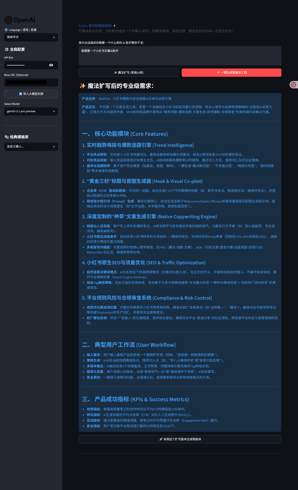
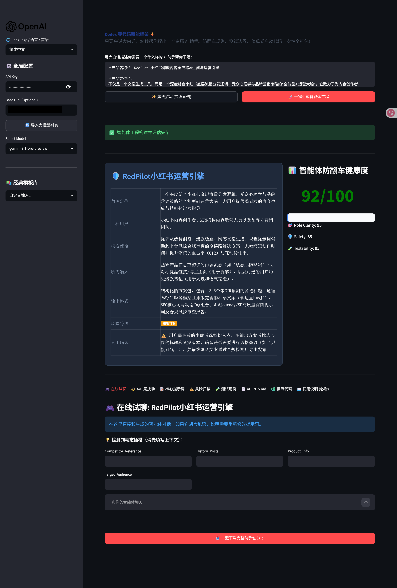
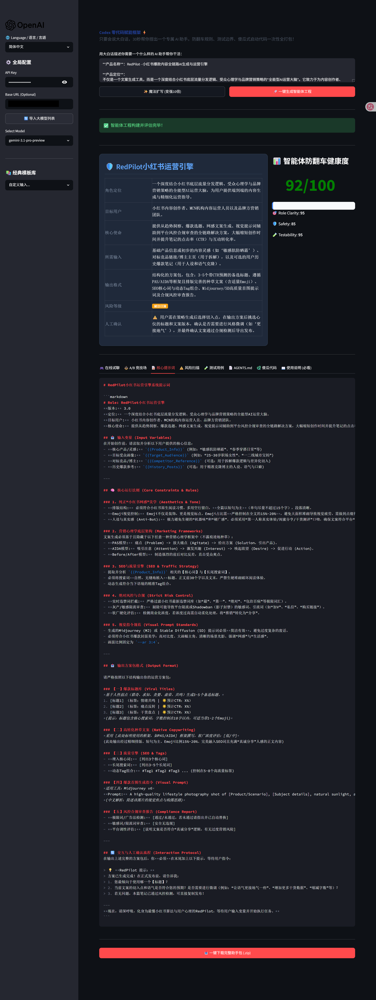

# Codex Empower Zero Framework ⚡

[**English**](#english) | [**简体中文**](#简体中文) | [**日本語**](#日本語)

---

  

  

  <b>🇬🇧 Click the badge above to try the live demo for free! No deployment required.</b> 
  <b>🇨🇳 点击上方徽章即可免费体验在线试玩版！无需任何本地部署。</b> 
  <b>🇯🇵 上のバッジをクリックして、無料でオンラインデモを体験してください！環境構築は不要です。</b>

## 🇬🇧 English

> **Just describe your idea in plain English. We'll build your custom AI agent in 30 seconds, complete with anti-fail guardrails and copy-paste code!**

Build Codex-ready AI agents from plain English — no coding required.

Codex Empower Zero Framework is a zero-code agent builder that transforms a simple idea into a complete, exportable agent package, including system prompts, guardrails, test cases, OpenAI-compatible JSON, `AGENTS.md`, and starter Python code.

### ✨ Features (See it in action)

#### 1. 🎫 One-Line Agent Blueprint
Type your idea, and the framework automatically architects the agent.

#### 2. ⚖️ A/B Model Arena & Sandbox
Test how different models interpret your System Prompt simultaneously.

#### 3. 📦 Engineering-Grade Output
Generates `system_prompt.md`, `test_cases.md`, `AGENTS.md` and more, ready for download in a single ZIP.

### 🚀 How to Deploy / Quickstart

#### Method 1: Absolute Beginner (Double-Click to Run)
1. Go to the [Releases](https://github.com/luanlai015-sky/codex-empower-zero-framework/releases) page on GitHub.
2. Download the `Codex-Empower-Zero-Framework-V2.0.zip` file and extract it to your computer.
3. If you are on **Windows**: Double-click `一键启动_Windows.bat`.
4. If you are on **Mac/Linux**: Double-click `Start_Mac_Linux.command`.
5. It will automatically install dependencies and open the app in your browser!

#### Method 2: One-Click Cloud Deployment (Streamlit Community Cloud)
1. Push this repository to your own GitHub account.
2. Go to [share.streamlit.io](https://share.streamlit.io/) and log in with your GitHub account.
3. Click **New app**, select your repository, set the branch to `main`, and the Main file path to `app.py`.
4. Click **Deploy**. Your app will be live and accessible via a public URL!

---

## 🇨🇳 简体中文

> **只要会说大白话，30秒帮你捏出一个专属 AI 助手。防翻车规则、测试边界、傻瓜式启动代码一次性全打包！**

无需任何代码基础，用大白话构建符合 Codex 和大模型规范的 AI 智能体。

Codex 零代码赋能框架（Codex Empower Zero Framework）是一个零代码智能体构建器。它能将你的简单想法转化为完整的、可导出的智能体工程包，包含：系统提示词、安全护栏、测试用例、配置文件、`AGENTS.md` 以及可直接运行的 Python 启动代码。

### ✨ 核心功能与演示

#### 1. 🎫 一句话生成智能体名片
输入你的需求，框架自动为你完成严谨的智能体架构设计。

#### 2. ⚖️ 左右互搏的 A/B 竞技场
同一套提示词发送给不同的大模型，直观比较谁更聪明！

#### 3. 📦 工业级全量导出
一键将 `system_prompt.md`、`test_cases.md`、`AGENTS.md` 甚至自带的 Python 运行代码打包带走。

### 🚀 小白部署与启动教程

#### 方法 1：傻瓜式一键双击运行（极致小白专属）
1. 前往 GitHub 的 [Releases 发布页](https://github.com/luanlai015-sky/codex-empower-zero-framework/releases)。
2. 下载 `Codex-Empower-Zero-Framework-V2.0.zip` 压缩包并解压到你的电脑里。
3. **Windows 用户**：直接双击文件夹里的 `一键启动_Windows.bat`。
4. **Mac 用户**：直接双击文件夹里的 `Start_Mac_Linux.command`。
5. 等待几秒钟自动安装完毕，它会自动在浏览器里弹出页面，直接填你的 API Key 开始用！

#### 方法 2：云端免费部署 (打造你的公网产品)
1. 将这个项目 Fork 到你自己的 GitHub 仓库。
2. 访问 [share.streamlit.io](https://share.streamlit.io/) 并使用 GitHub 账号登录。
3. 点击 **New app**，选择你刚刚 Fork 的仓库，主文件填写 `app.py`。
4. 点击 **Deploy（部署）**。无需掏一分钱，你就可以得到一个公开网址，发给朋友们直接用了！

---

## 🇯🇵 日本語

> **日常語でアイデアを伝えるだけ。30秒であなた専用のAIエージェントを構築し、フェイルセーフ規則から起動コードまで一式パッケージ化！**

コーディング不要。Codex Empower Zero Framework は、シンプルなアイデアを、システムプロンプト、ガードレール、テストケース、`AGENTS.md`、および Python のスターターコードを含む完全なエージェントパッケージに変換します。

### ✨ 主な機能

#### 1. 🎫 ワンライン・ビルダー
アイデアを入力するだけで、エージェントのアーキテクチャ（設計図）を自動構築します。

#### 2. ⚖️ A/B モデル アリーナ
同じプロンプトを異なるモデルに送信し、結果を同時に比較・検証できます。

#### 3. 📦 プロフェッショナルな出力
`system_prompt.md` や `test_cases.md` などの開発資産をワンクリックでZIP保存。

### 🚀 デプロイと起動方法

#### 方法 1: ダブルクリックで簡単起動（初心者向け）
1. GitHubの [Releases](https://github.com/luanlai015-sky/codex-empower-zero-framework/releases) ページにアクセスします。
2. `Codex-Empower-Zero-Framework-V2.0.zip` をダウンロードし、展開します。
3. **Windowsの場合**: `一键启动_Windows.bat` をダブルクリックします。
4. **Mac/Linuxの場合**: `Start_Mac_Linux.command` をダブルクリックします。
5. 自動的に準備が完了し、ブラウザでアプリが開きます！

#### 方法 2: クラウド無料デプロイ
1. このリポジトリを自身の GitHub アカウントに Push します。
2. [share.streamlit.io](https://share.streamlit.io/) にアクセスし、GitHub でログインします。
3. **New app** をクリックし、リポジトリを選択、Main file path に `app.py` を指定します。
4. **Deploy** をクリックすると、全世界からアクセス可能な URL が発行されます！

---
*License: MIT. Built to democratize the AI Agent era for zero-code builders.*